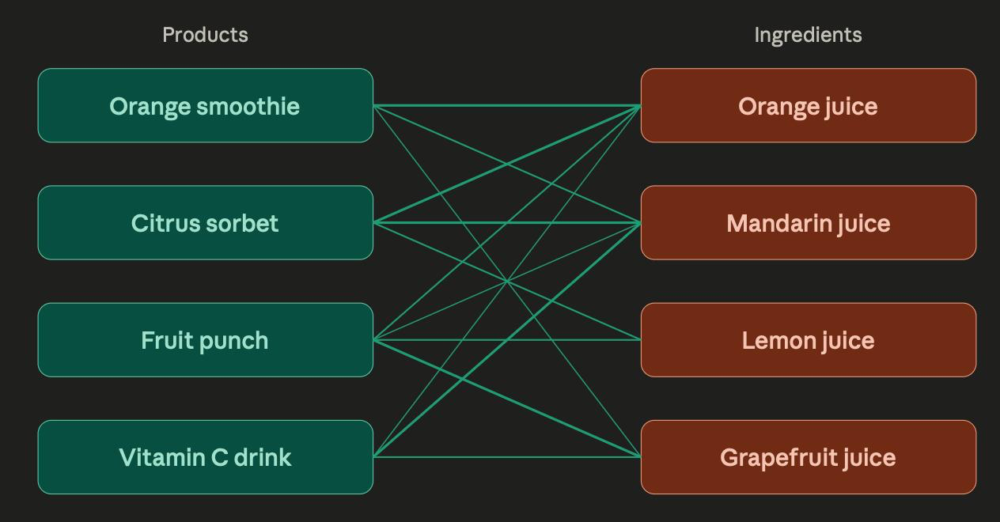
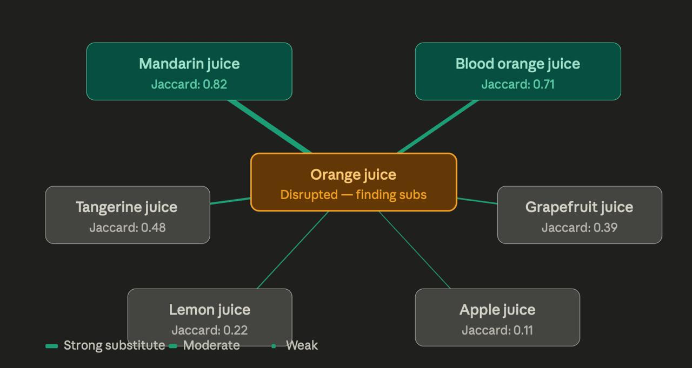

# makeathon-2026-spherecast

# 🔄 Smart Ingredient Substitution Pipeline

**Overview**
This pipeline automates the process of finding viable, cost-effective, and low-risk substitute ingredients for our manufacturing process. It leverages chemical databases, supplier logistics, and LLM-driven analysis to recommend the best alternatives.

* **Inputs:** BOM-Ingredient (Target for substitution), Company Location.
* **Ultimate Goal:** Identify the best chemical/ingredient substitutes and the optimal suppliers to source them from.
* **Final Output:** A clean UI displaying the **Top 3** recommended substitutes and their respective suppliers.

---

### Phase 1: Discovery & Chemical Profiling
*The goal here is to understand the chemical makeup of the target ingredient and find similar product families.*

* **Step 1: Product Clustering**
    Group similar products and product families to understand the broader context of how this ingredient is used.

* **Step 2: Chemical Component Extraction**
    Query the **PubChem API** to break down the target ingredient into its base chemical components. 

### Phase 2: Feasibility & Initial Filtering
*The goal here is to use AI to ensure the chemically similar ingredients actually work in our specific recipe.*

* **Step 3: LLM Contextual Validation**
    Send the chemical components to an LLM. Ask: *"Can these components actually act as a substitute in this specific context?"* * **Prompt Context Provided:** The clustered similar products AND all other current ingredients in our product's BOM (to avoid negative chemical reactions or flavor profile clashes).
* **Step 4: Shortlisting**
    The LLM outputs a curated list of possible substitutions, each tagged with a **Confidence Score** (e.g., 0-100%).

    

### Phase 3: Logistics & Sourcing Enrichment
*The goal here is to attach real-world business data (price, supplier, distance) to our shortlisted substitutes.*

* **Step 5: Pricing Integration**
    Attach pricing data to the shortlisted substitutes. 
    * *Hackathon State:* Mocked via a static list/JSON.
    * *Production State:* Integration with the **Mintec API**.
* **Step 6: Supplier Matching**
    Query our internal database to find all known suppliers that carry these shortlisted substitutes.
* **Step 7: Geolocation Routing**
    Ping the **Google Places API** to get the exact coordinates/locations of these suppliers to calculate shipping distances.

### Phase 4: The Decision Engine
*The final LLM evaluation that acts as a supply chain manager, weighing all factors to make a final business decision.*

* **Step 8: Multi-Criteria Recommendation**
    Feed the entire dataset (BOM, Shortlist + Confidence Scores, Prices, Suppliers, Locations) into the LLM. The LLM will evaluate and rank the options based on the following strict criteria:
    * **Substitutability:** Confidence score of the chemical match.
    * **Risk Factors:** Physical/chemical differences (e.g., moisture content, texture impact).
    * **Supply Chain Risk:** Geopolitical or logistical risks based on the supplier's location.
    * **Speed / Distance:** Transit distance between our company's location and the supplier.
    * **Price:** Cost efficiency of the substitute.
    * **Sustainability:** Environmental impact of the material or the shipping distance.
    * **BOM Compatibility:** How it interacts with the other existing ingredients in the product.

---

### 💻 Final Output / Deliverable
The backend will serve the results to the frontend, which will render a **Clean UI Dashboard**. 

The UI must highlight the **Top 3 Choices**, displaying:
1.  The recommended substitute ingredient.
2.  The recommended supplier.
3.  A brief LLM-generated summary of *why* it was chosen (highlighting price, distance, and confidence score).